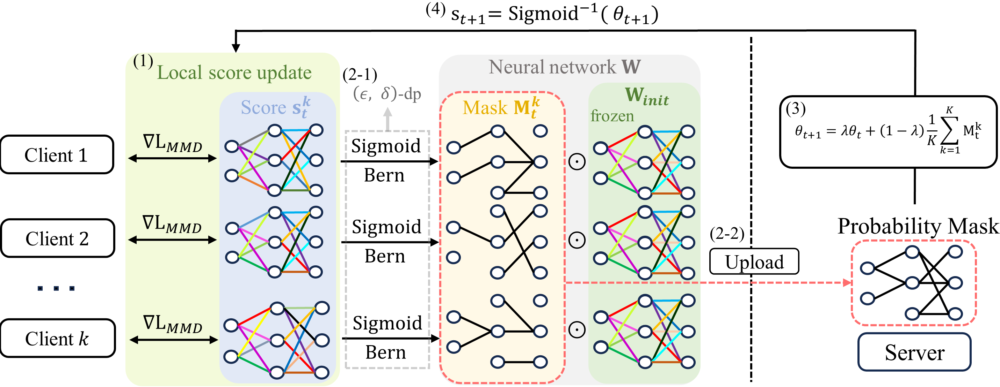
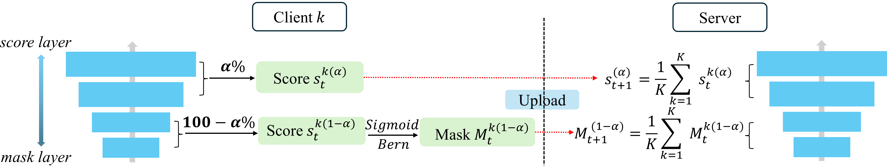

# [ICLR'25] PRISM: PRivacy-preserving Improved Stochastic Masking for federated generative models

<a href=''></a> <a href=''></a> <a href='https://tjrudrnr2.github.io/PRISM_ICLR25/'></a>




## 📌 News 📌
[2025.01.22] - 🎊 **PRISM** has been accepted by ICLR 2025! 🎊

## Usage
### Installation
```
conda create -n prism python=3.10.9
conda activate prism
pip install -r requirements.txt
pip3 install torch torchvision torchaudio
mkdir embeddings embeddings/npz embeddings/precompute
```
### WanDB
```
wandb login PERSONAL_API_KEY
```
- --save=True is an optional, only when logging to WANDB.

## Training
### IID and DP case
```
python ./run_prism.py --model=prism --aggregation=BA --dataset={mnist|fmnist|celeba|cifar} --gpu=0 --iid=1 --gpunum=0 --num_scorelayer=0 --epochs=500 --experiments=EXRIMENTS --dp_epsilon=9.8 --MADA
```
### Non-IID case and DP case
- Shards split : --split shards --divide=4
- dirichlet split : --split dirichlet --dir_alpha 0.005
```
python ./run_prism.py --model=prism --aggregation=BA --dataset={mnist|fmnist|celeba|cifar} --gpu=0 --iid=0 --split {shards | dirichlet} --divide=4 --dir_alpha 0.005 --gpunum=0 --num_scorelayer=0 --epochs=500 --experiments=EXRIMENTS --dp_epsilon=9.8 --MADA
```
### PRISM-$\alpha$


- --num_scorelayer=0~1, for PRISM-$\alpha$. Default configuration is 0 (equivalent with PRISM).
